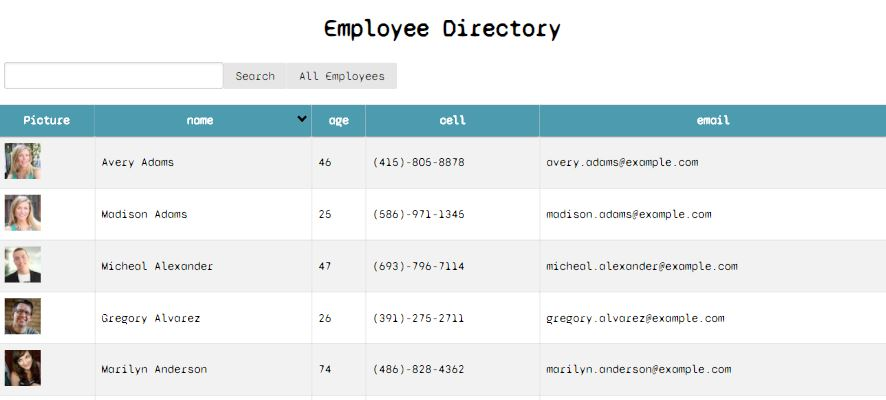

# React Employee Directory
  

  
  
  ## Description 
  Live site - [Employee Directory](https://jk-employee-directory.herokuapp.com/)

  Learning react is huge! The power of the virtual DOM, compoenents, properties, and state all make development a breeze...once you get the hang of it. This employee directory is a step in that direction. Using the random person api we can get a mock dataset. Using state and componenets we are able to render this assortment of 'empoloyees' to the page.
  
  ## Table of Contents
  * [Installation](#installation)
  * [Usage](#usage)
  * [Credits](#credits)
  * [License](#license)
  * [Contributions](#contributing)
  * [Tests](#tests)
  
  ## Installation 
  - Clone the repository. 
  - NPM install to get dependencies. 
  - Enjoy!
  
  ## Usage
  Feel free to use the deployed version [here](https://jk-employee-directory.herokuapp.com/) 
  
  Or after cloneing locally npm start the react server. Then use the sort by name button, or search field to narrow in on certain employees
  
  ## Credits
  Thanks to the react teame for making npx create-react-app a breeze
  
  ## License
  MIT
  
  ## Contributing
  Not at this time
  
  ## Tests
  none
  
  ## Questions
  Have quesitons about this repo? Please reach out on github or via email
  * [clubkemp](https://github.com/clubkemp)
  * kempj2.jk@gmail.com